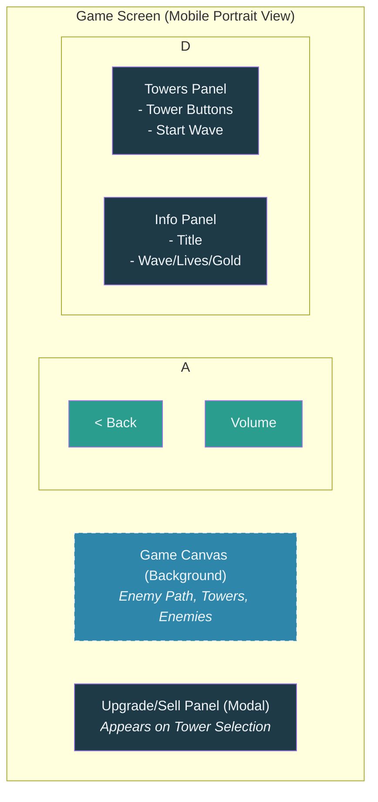

# Crabada Defense - User Interface Design Document

## 1. UI Design Philosophy

### 1.1 Core Principles
- **Clarity**: Information is easy to read and understand.
- **Accessibility**: UI works for players with different abilities.
- **Responsiveness**: Adapts to different screen sizes, with a mobile-first approach.
- **Consistency**: Uniform design language throughout the game.
- **Efficiency**: Minimal clicks to perform critical actions.

### 1.2 Visual Style
- **Theme**: Stylized, vibrant underwater / marine theme.
- **Color Palette**: Rich blues, contrasting accents, and clear feedback colors.
- **Typography**: Clean, modern, and highly readable sans-serif fonts.
- **Icons**: Simple, universally recognizable symbols.
- **Layout**: Clean, organized, and uncluttered, prioritizing the gameplay area.

## 2. Color Scheme

### 2.1 Primary Colors
- **Primary Blue**: #2E86AB (Ocean theme, game background)
- **Dark Blue**: #1E3A47 (UI panels)
- **Accent Orange**: #F4A261 (Tower bodies, projectiles)
- **Accent Green**: #2A9D8F (Buttons, positive actions, selection highlights)
- **Accent Red**: #E76F51 (Sell button, negative actions)
- **Text Light**: #f0f4f8 (Primary text color for high contrast)

### 2.2 Background Colors
- **Main Background**: #000000 (Outer page area, providing focus)
- **Game Container**: #1E3A47 (The main game view container)
- **Panel Background**: rgba(0, 30, 40, 0.7) (Translucent panels with a frosted glass/blur effect)
- **Button Default**: #F4A261 (Default Tower Button)
- **Button Selected**: #2A9D8F (Selected Tower/Action Button)

### 2.3 Text Colors
- **Primary Text**: #f0f4f8 (Light text on dark backgrounds)
- **Secondary Text**: #B8C5CC (For sub-text like cost or minor labels)
- **Disabled Text**: #6B7B85 (For disabled buttons and elements)

## 3. Typography

### 3.1 Font Family
- **Primary Font**: 'Segoe UI', 'Roboto', 'Helvetica Neue', Arial, sans-serif (A clean, modern, and widely available sans-serif font is preferred for readability).

### 3.2 Font Sizes & Weights
- **H1 (Game Title)**: 1.5rem, 700 (bold)
- **H2 (Panel Titles)**: 1.1rem, 600 (semi-bold)
- **Body/Buttons**: 1rem, 600 (semi-bold)
- **Stats/Labels**: 1.1rem
- **Small Text (e.g., cost)**: 0.8em

## 4. Layout Structure

### 4.1 Main Game Screen Layout (Mobile-First)

The game is designed with a mobile-first, portrait-aspect-ratio (9:16) layout. All UI elements are scaled relative to the container size to ensure consistency across devices. The primary goal is to keep the central game canvas as clear as possible.



### 4.2 UI Panel Placement
- **Top Bar**: Sits at the top of the screen containing navigation and sound controls.
- **Towers Panel**: Positioned on the top-left, containing tower selection buttons and the "Start Wave" button.
- **Info Panel**: Positioned top-center/right, displaying game state (Wave, Lives, Gold).
- **Upgrade Panel**: A modal panel that appears at the bottom of the screen when a placed tower is selected. It overlays the canvas temporarily.

### 4.3 Responsive Design
The primary container maintains a 9:16 aspect ratio. On wider screens, it centers with black letterboxing. On taller screens, it fits the height. UI elements use relative units (`rem`, `em`, `%`) to scale properly within this container.

## 5. Game Screen Interface

### 5.1 Top Bar
- **Elements**: Back button, Sound toggle button.
- **Styling**: Circular buttons with a semi-transparent dark background for good visibility.

### 5.2 Towers Panel
- **Elements**:
    - "Towers" title.
    - A button for each tower type, displaying its name and cost.
    - A "Start Wave" button to initiate the next round.
- **Styling**: A single card with a blurred, translucent background. Buttons are rounded rectangles. The selected tower button has a distinct "selected" state (green highlight and glow). Disabled buttons are faded to indicate they are un-clickable.

### 5.3 Info Panel
- **Elements**: Game title, Wave number, Lives count, and Gold count.
- **Styling**: A single card with a blurred, translucent background. Stats are displayed in a clean two-column layout (Label: Value) for quick readability.

### 5.4 Upgrade & Sell Panel
- **Elements**: Tower Name/Level, current stats (Damage, Range, Speed), an "Upgrade" button with cost, and a "Sell" button with its return value.
- **Styling**: A modal panel that appears at the bottom of the screen. Uses the same translucent style. The Upgrade button is green to signify a positive action, and the Sell button is red for a destructive action.

## 6. Game Canvas & Map Design

### 6.1 Path Visualization
The enemy path is a crucial visual element. It is rendered as a wide, semi-transparent track with soft edges, clearly visible against the animated background but not so bold as to be distracting.

### 6.2 Level Designs (Levels 1-5)

#### Level 1: "The Loop" (Tutorial)
**Difficulty**: Very Easy | **Enemy Types**: Minions only
**Path Design**: Simple S-curve for learning basic mechanics

**Visual Path:**
```
    [Start] 
       ↓
    ┌─────┐
    │     │
    │  A  │
    │     │
    └─────┘
       ↓
┌─────┐
│     │
│  B  │
│     │
└─────┘
   ↓
┌─────┐
│     │
│  C  │
│     │
└─────┘
   ↓
        ┌─────┐
        │     │
        │  D  │
        │     │
        └─────┘
           ↓
        ┌─────┐
        │     │
        │  E  │
        │     │
        └─────┘
           ↓
        [End]
```

**Path Coordinates**: (0.5,1.1) → (0.5,0.85) → (0.15,0.85) → (0.15,0.6) → (0.85,0.6) → (0.85,0.35) → (0.5,-0.1)
**Tower Spots**: 4 spots in center area
**Waves**: 5 waves, 5-8 enemies each

---

#### Level 2: "The Zigzag" 
**Difficulty**: Easy | **Enemy Types**: Minions, introduces Brutes
**Path Design**: Zigzag pattern with tighter curves

**Visual Path:**
```
[Start]
   ↓
┌─────┐
│     │
│  A  │
│     │
└─────┘
   ↓
        ┌─────┐
        │     │
        │  B  │
        │     │
        └─────┘
           ↓
┌─────┐
│     │
│  C  │
│     │
└─────┘
   ↓
        ┌─────┐
        │     │
        │  D  │
        │     │
        └─────┘
           ↓
┌─────┐
│     │
│  E  │
│     │
└─────┘
   ↓
[End]
```

**Path Coordinates**: (0.5,1.1) → (0.2,0.9) → (0.8,0.7) → (0.2,0.5) → (0.8,0.3) → (0.5,0.1) → (0.5,-0.1)
**Tower Spots**: 6 spots (3 on each side)
**Waves**: 6 waves, 8-12 enemies each

---

#### Level 3: "The Spiral"
**Difficulty**: Medium | **Enemy Types**: Minions, Brutes, introduces Swarmers
**Path Design**: Spiral pattern with enemies moving inward then outward

**Visual Path:**
```
    [Start]
       ↓
┌─────────────┐
│             │
│  ┌───────┐  │
│  │       │  │
│  │   A   │  │
│  │       │  │
│  └───────┘  │
│             │
└─────────────┘
       ↓
┌─────────────┐
│  ┌───────┐  │
│  │       │  │
│  │   B   │  │
│  │       │  │
│  └───────┘  │
└─────────────┘
       ↓
┌─────────────┐
│             │
│  ┌───────┐  │
│  │       │  │
│  │   C   │  │
│  │       │  │
│  └───────┘  │
│             │
└─────────────┘
       ↓
    [End]
```

**Path Coordinates**: (0.5,1.1) → (0.3,0.8) → (0.7,0.8) → (0.5,0.5) → (0.3,0.2) → (0.7,0.2) → (0.5,-0.1)
**Tower Spots**: 8 spots (4 inner, 4 outer)
**Waves**: 7 waves, 10-15 enemies each

---

#### Level 4: "The Maze"
**Difficulty**: Hard | **Enemy Types**: Minions, Brutes, Swarmers, introduces Bosses
**Path Design**: Complex maze-like pattern with multiple decision points

**Visual Path:**
```
[Start]
   ↓
┌─────┐
│     │
│  A  │
│     │
└─────┘
   ↓
┌─────┐
│     │
│  B  │
│     │
└─────┘
   ↓
        ┌─────┐
        │     │
        │  C  │
        │     │
        └─────┘
           ↓
┌─────┐
│     │
│  D  │
│     │
└─────┘
   ↓
        ┌─────┐
        │     │
        │  E  │
        │     │
        └─────┘
           ↓
┌─────┐
│     │
│  F  │
│     │
└─────┘
   ↓
[End]
```

**Path Coordinates**: (0.5,1.1) → (0.2,0.9) → (0.2,0.6) → (0.8,0.6) → (0.2,0.3) → (0.8,0.3) → (0.5,0.1) → (0.5,-0.1)
**Tower Spots**: 10 spots (strategic choke points)
**Waves**: 8 waves, 12-20 enemies each

---

#### Level 5: "The Gauntlet"
**Difficulty**: Very Hard | **Enemy Types**: All types, heavy boss presence
**Path Design**: Long, winding path with minimal tower placement options

**Visual Path:**
```
[Start]
   ↓
┌─────┐
│     │
│  A  │
│     │
└─────┘
   ↓
        ┌─────┐
        │     │
        │  B  │
        │     │
        └─────┘
           ↓
┌─────┐
│     │
│  C  │
│     │
└─────┘
   ↓
        ┌─────┐
        │     │
        │  D  │
        │     │
        └─────┘
           ↓
┌─────┐
│     │
│  E  │
│     │
└─────┘
   ↓
        ┌─────┐
        │     │
        │  F  │
        │     │
        └─────┘
           ↓
┌─────┐
│     │
│  G  │
│     │
└─────┘
   ↓
[End]
```

**Path Coordinates**: (0.5,1.1) → (0.2,0.95) → (0.8,0.8) → (0.2,0.65) → (0.8,0.5) → (0.2,0.35) → (0.8,0.2) → (0.5,0.05) → (0.5,-0.1)
**Tower Spots**: 6 spots (very limited placement)
**Waves**: 10 waves, 15-25 enemies each

### 6.3 Tower Placement Spots
- Pre-defined locations where towers can be built.
- Visualized as faint, dashed circles on the map.
- When a tower is selected for purchase, these spots should become more prominent (e.g., glow with a green fill) to indicate valid placement locations.
- Occupied spots are not shown as available placement locations.

## 7. Detailed UI Layout Specifications

### 7.1 Screen Dimensions & Grid System
**Base Container**: 9:16 aspect ratio (portrait mobile)
**Grid System**: 12-column grid for precise positioning
**Safe Areas**: 4% margin from all edges

### 7.2 Component Positioning & Sizing

#### Top Bar (Row 1, Columns 1-12)
```
┌─────────────────────────────────────┐
│ [←]                    [🔊]         │
└─────────────────────────────────────┘
```
- **Height**: 8% of screen height
- **Back Button**: 12% width, left-aligned, 4% margin
- **Sound Button**: 12% width, right-aligned, 4% margin
- **Background**: Semi-transparent overlay

#### Towers Panel (Row 2-4, Columns 1-4)
```
┌─────────┐
│ Towers  │
├─────────┤
│ [Crab]  │
│  Cost   │
├─────────┤
│[Lobster]│
│  Cost   │
├─────────┤
│[Start]  │
└─────────┘
```
- **Width**: 30% of screen width
- **Height**: 25% of screen height
- **Position**: Top-left, 4% margin from top and left
- **Background**: Frosted glass effect (rgba(0,30,40,0.7))
- **Border Radius**: 1rem
- **Button Height**: 4rem each
- **Spacing**: 0.75rem between elements

#### Info Panel (Row 2-4, Columns 5-12)
```
┌─────────────────────┐
│     Crabada         │
├─────────────────────┤
│ Wave:    1          │
│ Lives:   20         │
│ Gold:    200        │
└─────────────────────┘
```
- **Width**: 55% of screen width
- **Height**: 25% of screen height
- **Position**: Top-right, 4% margin from top and right
- **Background**: Same as towers panel
- **Title**: Centered, 1.5rem font
- **Stats**: Two-column layout, 1.1rem font

#### Game Canvas (Row 5-11, Columns 1-12)
```
┌─────────────────────────────────────┐
│                                     │
│         GAME AREA                   │
│                                     │
│    [Path] [Towers] [Enemies]        │
│                                     │
│                                     │
└─────────────────────────────────────┘
```
- **Width**: 92% of screen width (4% margins)
- **Height**: 60% of screen height
- **Position**: Center of screen
- **Background**: Ocean blue (#2E86AB)
- **Path**: Semi-transparent overlay
- **Tower Spots**: Dashed circles when available

#### Upgrade Panel (Row 12, Columns 2-11)
```
┌─────────────────────────────────┐
│        Tower Name (Lvl 2)       │
├─────────────────────────────────┤
│ Damage: 25    Range: 110        │
│ Speed: 1.4                      │
├─────────────────────────────────┤
│ [Upgrade (150g)] [Sell (50g)]   │
└─────────────────────────────────┘
```
- **Width**: 75% of screen width
- **Height**: 15% of screen height
- **Position**: Bottom center, 3% margin from bottom
- **Background**: Darker frosted glass (rgba(0,30,40,0.8))
- **Border**: 1px solid rgba(255,255,255,0.2)
- **Buttons**: 48% width each, 2% gap between

### 7.3 Responsive Behavior

#### Mobile Portrait (Primary)
- All measurements as specified above
- Touch-friendly button sizes (minimum 44px)
- Swipe gestures for tower selection

#### Tablet Landscape
- Scale UI elements by 1.2x
- Adjust grid to 16 columns
- Maintain 9:16 aspect ratio with letterboxing

#### Desktop
- Maximum width: 400px
- Center with black letterboxing
- Mouse hover states for buttons

### 7.4 Visual Hierarchy

#### Primary Actions (Green)
- Start Wave button
- Upgrade button
- Selected tower buttons

#### Secondary Actions (Orange)
- Default tower buttons
- Back button
- Sound button

#### Destructive Actions (Red)
- Sell button

#### Information (White/Blue)
- Text labels
- Stats display
- Path visualization

### 7.5 Animation Specifications

#### Button Interactions
- **Hover**: Scale 1.05x, 0.2s ease
- **Press**: Scale 0.95x, 0.1s ease
- **Selected**: Glow effect, 0.3s ease

#### Panel Transitions
- **Show**: Fade in 0.3s ease
- **Hide**: Fade out 0.2s ease
- **Slide**: Transform 0.3s ease

#### Game Elements
- **Tower Placement**: Bounce effect
- **Enemy Death**: Fade + scale
- **Projectile**: Linear movement
- **Particles**: Fade out over lifetime

---
*The rest of the document, covering menus and other screens, can be updated later to reflect this new design language.* 